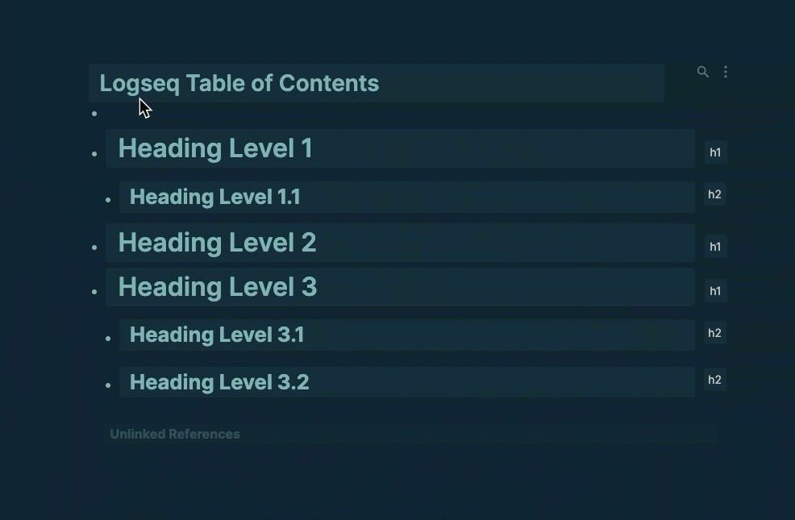

## Logseq Table of Contents Generator

This plugin lists all of the headings part of the current page and allows easy navigation.

Nested headings are only recognized if they are indented.

The following does *not* work:
```
# Level 1
## Level 2
```

The following works:
```
# Level 1
  ## Level 2
```

## Demo



## Installation

- Download the [latest release](https://github.com/mschmidtkorth/logseq-msk-toc/releases/tag/0.0.1)
- Extract the zip file
- Open Logseq > Three dots on the top right > Settings > Enable "Developer mode" at the bottom
- Open Logseq > Three dots on the top right > Plugins > Load unpackaged plugin